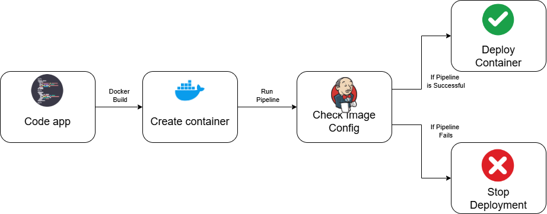

# Jenkins CI/CD Pipeline with Chainguard Security Verification

Welcome to our tutorial!
Today we will learn about how to set up a CI/CD pipeline using Docker, Jenkins and Chainguard.
These tools are widely used in the industry and have a well established reputation. Jenkins eases the workload for fast software delivery frameworks like Scrum or CD/CI.
Docker decouples the execution of application and libraries from the OS that we use. This in turn allows us to simplify the deployment of our applications.
By combining both tools we achieve the perfect automation for our software development cycle.
Let's find out more about these tools.

## Jenkins
Jenkins is an open source tool that can help to automate all the software creatin process. From the building stage to testing and deployment. This tool is written in Java and runs over the Java VM.
By using this tool we will simplify the process of deploying our software and verify automatically that the containers that we are using are safe.
That way our CD/CI pipeline will be automated and we will only have to focus on developing our app.

## Chainguard
Chainguard is an open source solution that verifies that the containers, libraries or VMs that we use are free of vulnerabilities.
They keep a database with all the versions of these tools. Then with a simple command we can check if the container that we intend to use is the safe version or not. We will see this in more detail during the tutorial.

## Docker
Docker makes it so that we can develop one app without taking into account where it will be deployed. It simplifies the software creation process by allowing the decoupling and portability of applications that can later be deployed anywhere. Even in the cloud.

## Structure
Our pipeline has the following structure:

# Intended learning outcomes
After this tutorial you will be able to:
- Set up a docker instance and a container.
- Set up a Jenlins pipeline for CI/CD.
- Use Chainguard to verify that your containers are safe.

Let's go!
